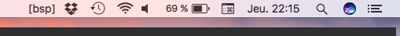

# KWM Menubar Status Indicator

Simple Python script to display a menubar status indicator.



## Download

[Download](dist/menu_status.zip)

## Build from source

```
$ pip install pyobjc
$ ./package_app.sh
```
